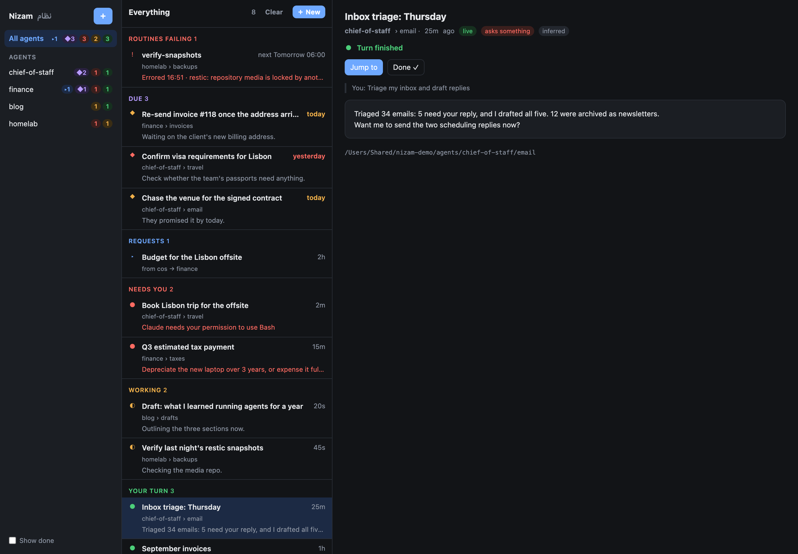

# Nizam · نظام

**A manager's view of your Claude Code agents.**

Nizam treats every folder you run Claude Code in as an *agent*: a colleague with a role, standing
topics, and a queue of conversations with you. It shows, at a glance, which agent needs you,
which is working, and which has finished and is waiting for your reply. It lives in the macOS
menu bar and a floating badge, and opens the same board in a popover or a browser.

<p>
  <a href="LICENSE"></a>
  
  
  
</p>



## Why

Claude Code is built around one conversation in one terminal tab. That holds until you use it the way
it invites you to: five tabs across three projects, one blocked on a permission prompt you never saw,
one that finished an hour ago, one you forgot you started. Claude Code tells you none of this. You find
out by cycling through tabs.

Nizam is the layer above the session:

- **See who is waiting on you, across every tab.** One board sorts all your sessions into *Needs you*,
  *Working*, *Your turn* and *Done*, with live counts in the menu bar.
- **Nothing sits blocked in silence.** A permission prompt, a question, a plan to approve or a stalled
  run raises a notification the moment it happens, not when you next look at that tab.
- **One click back to the right place.** *Jump to* focuses the exact terminal tab of a live session;
  *Resume* reopens one that exited.
- **Work grouped by role, not by tab.** Folders become agents, their standing topics become areas, and
  each keeps its own instructions and journal, so a session starts with the right context.
- **A place for what is not a session yet.** Dated follow-ups sit beside an agent's sessions and turn
  red when they are overdue.
- **Unattended work that tells you when it breaks.** A routine is one file with a schedule. A run that
  fails, times out, or stops to ask a question nobody will answer shows up under *Needs you*.
- **Handoffs between agents, with you in the middle.** One agent can leave a request for another;
  nothing is delivered until you read it and start the session.
- **No file formats to learn: your agents already know them.** Nizam installs a Claude Code skill, so
  inside any session you say "remind us to chase the invoice on Friday" or "make this a routine, every
  weekday at 9" and the agent writes the right file in the right place.

It changes nothing about Claude Code itself. Nizam reads what Claude already writes to disk plus a few
hooks, keeps its own state in plain files, serves only on `127.0.0.1`, and `nizam uninstall` takes it
out again.

## Install

```bash
curl -fsSL https://raw.githubusercontent.com/Simply-Expert/nizam/main/install.sh | bash
```

That clones the code to `~/.nizam/src`, installs Claude Code hooks into `~/.claude/settings.json`
(a backup is kept beside it), builds a small PyObjC venv, links a `nizam` command, and starts the
app. Re-run the same line to upgrade. Nothing phones home and nothing needs an API key.

Manual install:

```bash
git clone https://github.com/Simply-Expert/nizam ~/.nizam/src && cd ~/.nizam/src
bin/nizam install      # hooks + venv
bin/nizam app          # menu bar + floating badge + local server
bin/nizam login on     # start at login
```

## First five minutes

1. Install, then open a terminal in any project and run `claude`. The folder appears on the board as
   an agent within a few seconds, and the session moves between *Working* and *Your turn* as you talk.
2. Give Claude something that needs a permission. The menu bar count turns red and a notification
   fires; **Jump to** on the board takes you to that tab.
3. In the session, say *"create an area for email"*. The agent makes `email/` with its
   `INSTRUCTIONS.md` and journal, and the board shows the area under the agent.
4. Say *"remind us to review the backlog on Monday"*. A follow-up appears under the agent, and on
   Monday it turns amber with a **Start session** button.
5. Say *"make this a routine, every weekday at 9"* after a task you want repeated. The agent writes
   `routines/<name>.md`, runs it once to check it, and syncs the schedule; the board shows its next
   run and last result.

Steps 3 to 5 work because of the `/nizam` skill, below. You never write these files by hand.

## The model

| Term | What it is | How Nizam finds it |
|---|---|---|
| **Agent** | A role you talk to, e.g. *Marketing*, *Backend*, *VA*. | The nearest folder above the session's start directory holding `CLAUDE.md`, `AGENTS.md` or a configured `.claude/`. Otherwise the start directory itself. |
| **Area** | A standing topic inside an agent, e.g. `channels/email`, `campaigns/sept-2026`. | Any sub-folder of the agent holding `INSTRUCTIONS.md`. Areas nest. Folders without the marker (`data`, `scripts`, `shared`) are not areas. |
| **Session** | One Claude Code conversation. | The transcript in `~/.claude/projects`. |
| **Follow-up** | A dated one-off the agent owes, not yet a session. | `## YYYY-MM-DD (Day) — [area] Title` sections in `FOLLOWUPS.md` at the agent root, where an optional `[area]` tag files an item under that area, or in a self-contained area's own `FOLLOWUPS.md`. The board merges them. Read-only. |
| **Routine** | Recurring work an agent does unattended, on a schedule: a headless Claude run, or a plain script. | `routines/<name>.md` at the agent root or inside an area: a `schedule:` header and the prompt. Read-only. |

Sessions fall into five states:

| State | Meaning | Source |
|---|---|---|
| **Needs you** | Claude is blocked: a permission prompt, `AskUserQuestion`, a plan to approve, or no progress for 5 minutes while busy. | Hook events |
| **Working** | Claude is processing. | Claude's own runtime status file |
| **Your turn** | Claude finished its turn in a session that is still open. | `Stop` hook, or idle status |
| **Closed** | The session exited without being marked done. Ages into Done after two days. | Process gone |
| **Done** | You marked it done, or it went two days without activity. New activity reopens it. | You |

Done is deliberately manual. The old approach of guessing "finished" from the wording of Claude's
last message was wrong too often; you are the only one who knows a task is over.

## Using it

- **Badge and menu bar**: live counts. Click for the board, right-click for options. The badge is
  draggable and exists because a full menu bar on a notched MacBook hides new status items.
- **Board**: agents on the left (pin, rename, drag to reorder via right-click), the selected agent's
  sessions in the middle with area chips, and the full last message on the right.
- **Jump to** focuses the live session's tab (Terminal.app, iTerm, Ghostty 1.3+). **Resume** reopens
  an exited one with `claude --resume`. **New here** starts a session in that agent and area with
  your last-used settings; ⌥-click for the full dialog (prompt, permission mode, git worktree,
  paste-only).
- **Follow-ups** appear under an agent's sessions, overdue in red and today in amber; *All agents*
  shows only what is due. **Start session** opens one with the follow-up as the first prompt. Nizam
  never edits the file: the agent records the outcome and deletes its own line.
- **Routines** appear under an agent's follow-ups with their next run and last result. A run that
  errored, timed out, or ended without confirming its work counts under *Needs you*, notifies, and
  shows in *All agents* until it succeeds or you dismiss it. **Run now** starts one by hand,
  **Open last run** resumes that run as a normal session, **Sync schedule** installs a new schedule.
- **Clear** marks every *Closed* session in the current view as done; hovering a Closed row shows a Done button.
- Keys: `j`/`k` move, `Enter` jumps, `d` marks done, `n` starts a session, `Esc` closes.
- Notifications fire when a session newly needs you.

Claude Code sessions started from the Claude desktop app appear too, but without a live status
and with Jump to opening the app rather than the chat. Regular desktop chats are not Claude Code
sessions and are not shown.

## The `nizam` skill

`nizam install` also copies a Claude Code skill to `~/.claude/skills/nizam`, so every agent knows
Nizam's conventions without being told: where an area's instructions and journal go, how a follow-up
is written, what a routine's header takes, who it may send requests to. Claude loads it when you ask
in plain words ("add a follow-up", "why did the digest routine fail", "any requests?", "hand this to
finance") or when you type the command:

```
/nizam area list
/nizam area new email          # creates INSTRUCTIONS.md + JOURNAL-<year>.md
/nizam area promote campaigns/sept-2026
/nizam area archive referral
/nizam followup add 2026-09-18 re-run the banner conversion script
/nizam followup tag                 # add [area] tags to untagged items
/nizam followup list
/nizam followup done banner
/nizam routine new weekly-digest    # routines/weekly-digest.md + its schedule
/nizam routine migrate nightly-scan # from a hand-made launchd job or cron line
/nizam routine list
/nizam request list                 # what other agents left for this one
```

## Requests

One agent can leave a request for another: finance notices a contract clause, and leaves it for legal.
You stay in the middle. A request is only queued; the board shows it under the receiving agent, and
that agent sees it when you press Start session or ask it to check (`nizam request list`). Nothing is
delivered on its own.

You decide who may write to whom in `~/.nizam/requests/links.md`:

```markdown
finance = ~/work/finance — invoices, budgets, tax
legal   = ~/work/legal — contracts, compliance

finance -> legal: contract review only
```

An agent only ever learns of the peers it has a link to (`nizam request peers`), described in your
words. Links are routing, not a sandbox: every agent runs as you, so they keep honest agents in their
lane and do nothing against a process that ignores them.

The text of a request was written by an agent, possibly after reading mail or the web. So the board
shows it in full and lets you edit it before starting; the session starts in plan mode; and the text
is handed over as a quoted request to weigh, not as your instruction. Routines cannot send requests, a
session started from a request cannot send one on, and a request nobody touches expires after 14 days.

A folder becomes visible on the board the moment it gets an `INSTRUCTIONS.md`.

## Routines

A routine replaces the usual trio of prompt file, shell wrapper and hand-written LaunchAgent with one file:

```markdown
---
schedule: sat-thu 09:30, 16:00, 22:00; fri 09:30
timeout: 30m
model: sonnet
allowed_tools: mcp__slack__*, Read, Write, Edit
---
You are the daily scan. 1. Read tasks/backlog.md …
```

`nizam routines sync` turns each `schedule:` into a LaunchAgent, so launchd is the clock: routines fire
whether or not the Nizam app is running, and a slot missed while the Mac slept runs once on wake.
`nizam run` is the single wrapper they all share:

- one run per agent at a time; a second routine queues instead of killing the first
- the login shell's `PATH`, so `node`-based MCP servers work under launchd
- `env_file: .env.local` in the header, for what a wrapper used to `source`
- a wall-clock timeout that kills the whole process group, and `caffeinate` so idle sleep does not cut a run short
- one retry when a run fails within 90 seconds, which is what a run fired on wake before the network is up looks like
- every run must end with `OUTCOME: COMPLETE`. A headless run that stops to ask "shall I proceed?"
  exits 0 having done nothing; here it is reported as *incomplete*
- the full stream of each run in `~/.nizam/routines/logs`, kept 30 days

**Script routines.** A `command:` line in the header runs a script instead of Claude, for collectors and
checks that need no judgement. Same schedule, PATH, timeout, log and board; success is exit code 0.

```markdown
---
schedule: monthly 6 09:07
command: node scripts/collect-monthly-snapshot.mjs
---
Collects last month's numbers into data/snapshots/. Feeds the monthly report.
```

When one fails, **Start session to fix** opens the agent with the command, the end of the output and
the log path as the first prompt. It is meant for scripts an agent owns, not as a general cron.

Already have routines as hand-made LaunchAgents with shell wrappers? Or as cron lines? Ask the agent to
`/nizam routine migrate <name>`: it translates the plist or crontab line and the wrapper, asks before the (real) test run,
and retires the old job in the same step it installs the new one.

Schedules: `manual`, `daily 09:30, 16:00`, `mon, wed 08:00`, `sat-thu 09:30` (ranges wrap),
`monthly 1 09:00`, `hourly :15`, joined with `;`. Local time. A slot missed while the Mac was powered
off or logged out is not made up.

## Commands

```
nizam app             menu bar + badge + server in one process
nizam app --quit      stop it
nizam app --detach    same, in the background; survives closing the terminal
nizam app --restart   stop it, wait for it to exit, start it again detached
nizam serve [--open]  server only, for the browser
nizam open            open the board in the browser
nizam install         install hooks + build the venv
nizam uninstall       remove hooks, skill and start-at-login
nizam routines list   this agent's routines: state, next run, last result
nizam routines sync   install this agent's schedules into launchd; remove those of deleted routines
nizam run <file>      run one routine now, headless
nizam request peers   the agents this one may write to
nizam request send <peer> <what>   leave a request; the user decides when it is seen
nizam request list    requests waiting for this agent, and what it sent
nizam request done <id>   close a request that was handled or declined
nizam login on|off    start at login (LaunchAgent)
nizam doctor          check wiring
```

## Files

| Path | Contents |
|---|---|
| `~/.nizam/state.json` | Your decisions: done flags, session titles, agent display names, pins, order, prefs |
| `~/.nizam/events.jsonl` | Hook events, including short snippets of prompts and replies. Trimmed to the last 14 days. Treat as private. |
| `~/.nizam/routines` | Routine run records (`runs.jsonl`, with the tail of each run's final reply), per-run logs, locks. Treat as private. |
| `~/.nizam/requests` | `links.md` (who may write to whom; yours to edit) and `requests.jsonl` (every request, refusal and outcome). Treat as private. |
| `~/Library/LaunchAgents/co.nizam.routine.*` | One per scheduled routine; written by `nizam routines sync`, removed by `nizam uninstall` |
| `~/.nizam/venv` | PyObjC for the Mac shell |
| `~/.nizam/src` | The code, when installed with the one-liner |
| `~/.claude/settings.json` | Gets eight `nizam/hook.py` hook entries; `nizam uninstall` removes them |
| `~/.claude/skills/nizam` | The `/nizam` skill; removed by `nizam uninstall` |

## Requirements

macOS 13+, Python 3.10+ able to create a venv (Homebrew or Xcode command-line tools),
Claude Code 2.1.158 or newer. No third-party Python packages outside the venv.

## Lineage

Nizam started as a rewrite of [claude-sessions-status](https://github.com/blink22/claude-sessions-status)
after the folder-and-heuristics model stopped fitting how the agents were actually used.

## License

MIT. See [LICENSE](LICENSE).
